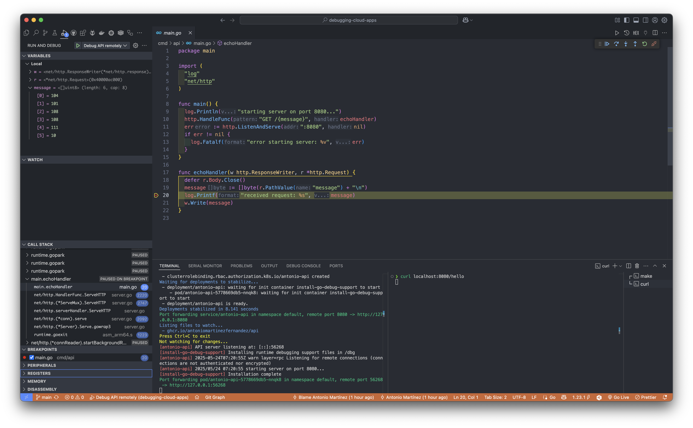

# Debugging Cloud Apps

## Requirements

1. [Docker Desktop](https://docs.docker.com/desktop/) / [Orbstack](https://orbstack.dev/)
1. [Kind](https://kind.sigs.k8s.io/docs/user/quick-start/)
1. [Skaffold](https://skaffold.dev/docs/install/)
1. [Kubectl](https://kubernetes.io/docs/tasks/tools/)
1. [Go](https://go.dev/doc/install)

## Getting Started

1. Install all the requirements
1. Create [github token (classic)](https://github.com/settings/tokens) with `[read:packages]` and `[write:packages]` permissions
1. Export `CR_PAT` environment variable with `export CR_PAT=YOUR_TOKEN` (replace `YOUR_TOKEN`)
1. Login into the GH docker registry with `echo $CR_PAT | docker login ghcr.io -u YOUR_USER_NAME --password-stdin` (replace `YOUR_USER_NAME`)
1. Replace `image` values in `skaffold.yaml` and `api.yaml` with your own github container registry (following pattern `ghcr.io/YOUR_USER_NAME/SERVICE_NAME` - **IMPORTANT**: `YOUR_USER_NAME` should be lowercase)
1. Run `make spawn`
1. Run `make debug`
1. In VSCode, go to `Menu - Run and Debug` and start `Debug API remotely`
1. Define some breakpoint in the `cmd/api/main.go` file
1. Run `curl localhost:8080/hello`
1. To remove the cluster, run `make destroy`
